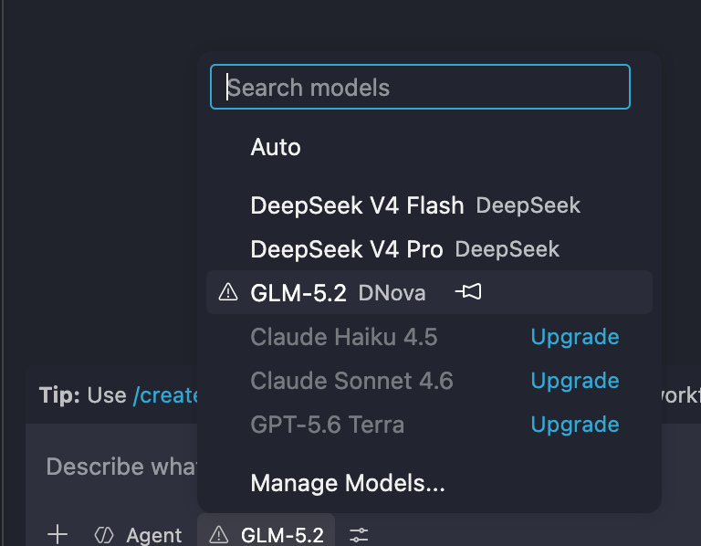
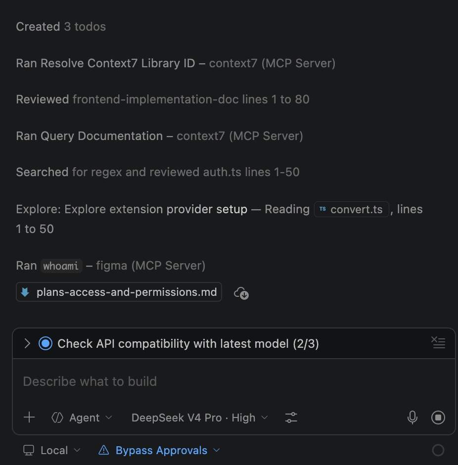
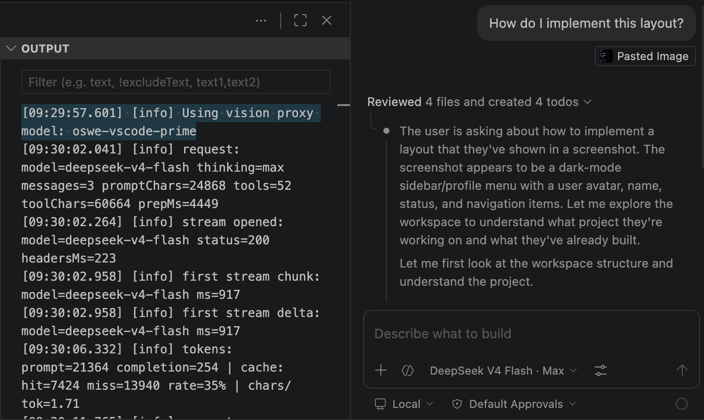

<h1 align="center">DNova for Copilot Chat</h1>

  <!-- marketplace-readme:remove-start -->
  
  
   
  <!-- marketplace-readme:remove-end -->
  

  English |
  <a href="https://github.com/luke/dnova-for-copilot/blob/main/README.zh-cn.md">简体中文</a>

**Pick DNova (GLM-5.2) in the Copilot Chat model picker — and get a built-in ABAP ADT MCP that talks to your SAP system, all with your own API key.**

  

Two things in one extension:

1. **DNova as a Copilot model** — drop **DNova GLM-5.2** straight into Copilot Chat's model selector. BYOK, zero config.
2. **Bundled ABAP ADT MCP** — a full SAP ABAP toolset (`@mcp-abap-adt/core`, 206 tools) ships inside the extension, so you can read, create, update and activate ABAP objects in SAP directly from Copilot Chat.

## Why this extension?

- **Power up Copilot, don't replace it.** No new sidebar or UI to learn — just a new model in the picker you already use, plus ABAP tools in the chat you already have.
- **Agent mode, tool calling, instructions, skills — all still work.** Copilot's entire stack, running on DNova.
- **Built-in ABAP ADT MCP (dnova-abap-mcp).** The `@mcp-abap-adt/core` server is bundled inside the extension — no separate install, no `npx`. Enable it, point it at your SAP system, and use natural language to work with ABAP objects.
- **BYOK, pay DNova directly.** Your API key, your bill, your rate limits. Stored in the OS keychain, never on disk.

## Features

### DNova GLM-5.2 in the model picker

The DNova model shows up alongside GPT-4o, Claude, and friends in Copilot Chat's model selector. Switch models mid-chat without losing history.

### Built-in ABAP ADT MCP (dnova-abap-mcp)

A complete SAP ABAP toolset is bundled with the extension:

- **206 ABAP tools** — read/create/update/delete/activate/check, runtime & debugging, and search
- **Works with on-premise (ECC/S4HANA), ABAP Cloud (BTP) and legacy** SAP systems
- **stdio-based**, launched automatically by VS Code when you chat — no separate MCP server to install
- **Use it in plain English** — "show me the source of class ZCL_BOOKING", "create table ZT_ORDER", "run the unit tests for this class"

Example tool families: `GetTableContents` · `GetPackageContents` · `SearchSource` · `GetSqlQuery` · `CreateClass` · `UpdateProgram` · `ActivateTable` · `CheckClass` · `RuntimeRunProgram` · `ListTransports` …

  

### Transparent Vision Proxy

DNova GLM-5.2 is text-only. Drop a screenshot into chat and the extension hands the image to another installed vision model, gets a description, and feeds it back to DNova — transparently.

  

### Secure by Default

- **DNova API key** lives in VS Code `SecretStorage` (OS keychain) — never in `settings.json` or Git history.
- **SAP password** can also be stored in `SecretStorage` (via `DNova: Set ABAP ADT MCP Password`) instead of `settings.json`.

### Zero Runtime Dependencies

Pure VS Code API + Node.js built-ins, plus the bundled `@mcp-abap-adt/core` MCP. No Python, no Docker, no separate server to babysit.

## Getting Started

### Prerequisites

- VS Code 1.116 or later
- A **DNova API key** (BYOK) — the extension is zero-config; you bring your own key and endpoint

### 1. Use DNova GLM-5.2 as your Copilot model

1. Run **DNova: Set API Key** from the Command Palette (`Cmd+Shift+P`)
2. Paste your DNova API key
3. Open Copilot Chat, click the model picker, pick **DNova (GLM-5.2)**
4. Done — chat away

> Endpoint is configured via `dnova-copilot.baseUrl` (defaults to the official DNova endpoint).

### 2. Use the built-in ABAP ADT MCP with your SAP system

1. Open Settings and fill in the SAP connection (`dnova-copilot.mcp.abapAdt.*`):
   - `url` — SAP system URL (e.g. `https://my-sap:44304`)
   - `client` — SAP client (e.g. `100`)
   - `username` / `password` — basic auth credentials
   - `systemType` — `onprem` / `cloud` / `legacy`
   - (alternative) `envPath` — point to an existing `.env` file with `SAP_URL`, `SAP_CLIENT`, `SAP_USERNAME`, `SAP_PASSWORD`, …
2. Reload the window (`Developer: Reload Window`)
3. In Copilot Chat, ask it to use ABAP tools — e.g. *"read the source of class ZCL_BOOKING"*
4. First tool use may ask you to **Allow in this Session** (VS Code's MCP trust prompt) — click allow.

Useful commands:

- **DNova: Show ABAP ADT MCP Config** — shows the exact `.env` path, launch args and a health check (which settings are missing)
- **DNova: Configure ABAP ADT MCP** — write the server into a global/workspace `mcp.json`
- **DNova: Set ABAP ADT MCP Password** — store the SAP password in the OS keychain

> The extension regenerates the `.env` automatically when you change the settings — no need to reload for most changes.

## Models

| Model                   | Best For                              |
| ----------------------- | ------------------------------------- |
| **DNova GLM-5.2** | Coding, agent tasks, ABAP development |

## Settings

| Setting                                        | Default                                 | Description                                               |
| ---------------------------------------------- | --------------------------------------- | --------------------------------------------------------- |
| `dnova-copilot.baseUrl`                      | `https://nova.deloitte.com.cn/del/v1` | DNova API base URL                                        |
| `dnova-copilot.maxTokens`                    | `0`                                   | Max output tokens (`0` = no limit)                      |
| `dnova-copilot.modelIdOverrides`             | `{ "glm-5.2": "glm-5.2" }`            | API model IDs to send                                     |
| `dnova-copilot.debugMode`                    | `minimal`                             | `minimal` / `metadata` / `verbose` diagnostics      |
| `dnova-copilot.mcp.abapAdt.enabled`          | `true`                                | Enable the bundled ABAP ADT MCP server                    |
| `dnova-copilot.mcp.abapAdt.url`              | `""`                                  | SAP system URL                                            |
| `dnova-copilot.mcp.abapAdt.client`           | `100`                                 | SAP client number                                         |
| `dnova-copilot.mcp.abapAdt.username`         | `""`                                  | SAP username                                              |
| `dnova-copilot.mcp.abapAdt.password`         | `""`                                  | SAP password (prefer`useSecretStorage`)                 |
| `dnova-copilot.mcp.abapAdt.useSecretStorage` | `false`                               | Store the SAP password in the OS keychain                 |
| `dnova-copilot.mcp.abapAdt.envPath`          | `""`                                  | Optional path to an existing`.env` with SAP credentials |
| `dnova-copilot.mcp.abapAdt.language`         | `EN`                                  | SAP logon language                                        |
| `dnova-copilot.mcp.abapAdt.systemType`       | `onprem`                              | `onprem` / `cloud` / `legacy`                       |
| `dnova-copilot.mcp.abapAdt.authType`         | `basic`                               | `basic` / `jwt`                                       |

## Commands

| Command                              | Description                                                  |
| ------------------------------------ | ------------------------------------------------------------ |
| `DNova: Set API Key`               | Store your DNova API key in the OS keychain                  |
| `DNova: Get API Key`               | Show whether an API key is configured                        |
| `DNova: Clear API Key`             | Remove the stored API key                                    |
| `DNova: Open Settings`             | Open the extension settings                                  |
| `DNova: Show Logs`                 | Open the extension output channel                            |
| `DNova: Open Request Dumps Folder` | Open the verbose debug dump folder                           |
| `DNova: Set ABAP ADT MCP Password` | Store the SAP password in the OS keychain                    |
| `DNova: Configure ABAP ADT MCP`    | Write the MCP server into`mcp.json` (global or workspace)  |
| `DNova: Show ABAP ADT MCP Config`  | Show`.env` path, launch args and a connection health check |

## Security

- API key and SAP password can be stored in VS Code `SecretStorage` (OS keychain).
- Set `dnova-copilot.mcp.abapAdt.useSecretStorage` to `true` and use **DNova: Set ABAP ADT MCP Password** to keep the SAP password out of `settings.json`.

## License

[MIT](LICENSE)
